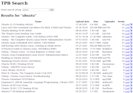

quick-dirty-pirate-bay-proxy
============================

A quick and dirty Pirate Bay proxy written in PHP

Installation
------------

Usually: just place the code in a web-hosted directory. That's all there is to it. :-)

If that didn't work, make sure your server runs PHP 7.0+ with the 'curl' and 'dom' extensions.

Optional features and tweaks
----------------------------

1. Copy `/config.dist.php` to `/config.php`
2. Configure `/config.php` to suit your needs

In this file, you can configure:

- ruTorrent support, for sending files to ruTorrent for downloading
- How many result pages are fetched from TPB (default is only 1 page)
- An intermediate proxy, between your server and TPB
